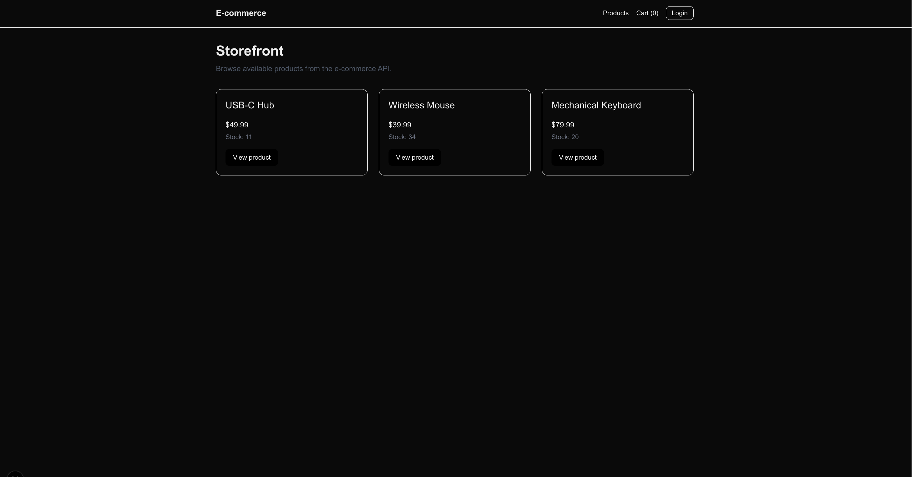

# E-commerce Platform

Full-stack e-commerce platform with a backend API, customer storefront, admin dashboard, background notification worker, PostgreSQL database, Redis queue, Docker Compose, Swagger docs, and integration tests.

## Demo Video
[](https://www.youtube.com/watch?v=u0hziNZr2fE)
Click the image to watch the demo on youtube.

## Tech Stack

- Backend: Node.js, Express, TypeScript, Prisma
- Database: PostgreSQL
- Queue/Jobs: Redis, BullMQ
- Frontend: Next.js, React, Tailwind CSS
- Auth: JWT, RBAC
- Testing: Vitest, Supertest
- DevOps: Docker Compose
- Docs: Swagger / OpenAPI

## Features

### Customer
- Browse active products
- View product details
- Add products to cart
- Login
- Checkout and create orders
- View order confirmation

### Admin
- Admin login
- Create products
- Edit products
- Soft-delete products
- View orders
- View notifications
- View audit logs

### Backend
- JWT authentication
- Role-based access control
- Product and inventory management
- Order creation with inventory decrement
- Audit logging
- Background notification jobs
- PostgreSQL persistence
- Redis queue processing
- OpenAPI documentation

## Architecture

```txt
Customer Storefront / Admin Dashboard
              |
              v
        Express API
              |
   -------------------------
   |           |           |
Postgres     Redis     Worker
Products     Queue     Notifications
Orders
Inventory
Audit Logs
```

## Database Design

The application uses PostgreSQL with Prisma ORM. The schema is designed around product catalog management, inventory tracking, order processing, background notifications, and audit logging.

### Main Tables

| Table | Purpose |
|---|---|
| `User` | Stores customer/admin accounts and role information. |
| `Product` | Stores product catalog data such as name, SKU, price, and active status. |
| `Inventory` | Tracks stock quantity and reserved quantity for each product. |
| `Order` | Stores customer orders and order status. |
| `OrderItem` | Stores individual products within an order, including quantity and price at purchase time. |
| `Notification` | Stores notification jobs and delivery status. |
| `AuditLog` | Records important system/admin actions for observability. |

### Entity Relationships

```txt
User
 ├── Order[]
 └── AuditLog[]

Product
 ├── Inventory 1:1
 └── OrderItem[]

Order
 ├── User many:1
 └── OrderItem[]

Notification
 └── Standalone job record

AuditLog
 └── Optional User reference
```

### ERD
```
┌─────────────┐
│    User     │
├─────────────┤
│ id          │
│ email       │
│ passwordHash│
│ role        │
│ createdAt   │
│ updatedAt   │
└──────┬──────┘
       │ 1
       │
       │ *
┌──────▼──────┐
│    Order    │
├─────────────┤
│ id          │
│ userId      │
│ status      │
│ totalCents  │
│ createdAt   │
│ updatedAt   │
└──────┬──────┘
       │ 1
       │
       │ *
┌──────▼──────┐        ┌─────────────┐
│  OrderItem  │ *    1 │   Product   │
├─────────────┤────────►─────────────┤
│ id          │        │ id          │
│ orderId     │        │ name        │
│ productId   │        │ description │
│ quantity    │        │ priceCents  │
│ unitPrice   │        │ sku         │
│ subtotal    │        │ isActive    │
└─────────────┘        │ createdAt   │
                       │ updatedAt   │
                       └──────┬──────┘
                              │ 1
                              │
                              │ 1
                       ┌──────▼──────┐
                       │  Inventory  │
                       ├─────────────┤
                       │ id          │
                       │ productId   │
                       │ quantity    │
                       │ reserved    │
                       │ createdAt   │
                       │ updatedAt   │
                       └─────────────┘


┌─────────────┐
│ Notification│
├─────────────┤
│ id          │
│ type        │
│ status      │
│ recipient   │
│ subject     │
│ body        │
│ errorMessage│
│ sentAt      │
│ createdAt   │
│ updatedAt   │
└─────────────┘


┌─────────────┐        ┌─────────────┐
│  AuditLog   │ *    1 │    User     │
├─────────────┤────────►─────────────┤
│ id          │        │ id          │
│ userId      │        │ email       │
│ action      │        │ role        │
│ entityType  │        └─────────────┘
│ entityId    │
│ metadata    │
│ createdAt   │
└─────────────┘
```

### Important Design Decisions
- `Product.isActive` is used for deactivation instead of hard deletion, allowing admins to restore inactive products.
- `OrderItem.unitPriceCents` stores the product price at the time of purchase so historical orders remain accurate even if product prices change later.
- `OrderItem.subtotalCents` stores the calculated item total for easier reporting and order display.
- `Inventory` is separated from Product so stock management can evolve independently from catalog data.
- `AuditLog.metadata` uses JSON to store flexible action details without requiring a new table for each event type.
- `Notification.status` tracks background job processing states such as PENDING, SENT, and FAILED.

### Enums
| Enum                 | Values                                                                                                           |
| -------------------- | ---------------------------------------------------------------------------------------------------------------- |
| `Role`               | `ADMIN`, `CUSTOMER`                                                                                              |
| `OrderStatus`        | `PENDING`, `PAID`, `CANCELLED`, `FULFILLED`                                                                      |
| `NotificationStatus` | `PENDING`, `SENT`, `FAILED`                                                                                      |
| `NotificationType`   | `ORDER_CREATED`, `ORDER_CANCELLED`, `LOW_STOCK`                                                                  |
| `AuditAction`        | `USER_REGISTERED`, `PRODUCT_CREATED`, `PRODUCT_UPDATED`, `ORDER_CREATED`, `ORDER_CANCELLED`, `INVENTORY_UPDATED` |


## Running Locally

### 1. Start infrastructure

```bash
docker compose up -d postgres redis
```

### 2. Install backend dependencies

```bash
npm install
```

### 3. Run migrations and seed

```bash
npx prisma migrate dev
npx prisma db seed
```

### 4. Start backend

```bash
npm run dev
```

Backend runs on:

```txt
http://localhost:3000
```

### 5. Start notification worker

```bash
npm run worker:notifications
```

### 6. Start frontend

```bash
cd storefront
npm install
npm run dev
```

Frontend runs on:

```txt
http://localhost:3001
```

## API Docs

Swagger docs:

```txt
http://localhost:3000/docs
```

## Test

```bash
npm test
```

## Demo Accounts

```txt
Admin:
admin@test.com
password123

Customer:
customer@test.com
password123
```

## Key API Endpoints

```txt
POST   /auth/login
GET    /products
GET    /products/:id
POST   /products
PATCH  /products/:id
DELETE /products/:id

POST   /orders
GET    /orders
GET    /orders/:id

GET    /notifications
GET    /notifications/:id

GET    /admin/products
GET    /admin/audit-logs
```

## Future Improvements

* Payment integration
* Product images
* Search and filtering
* Email provider integration
* OpenTelemetry tracing
* Deployment to cloud
